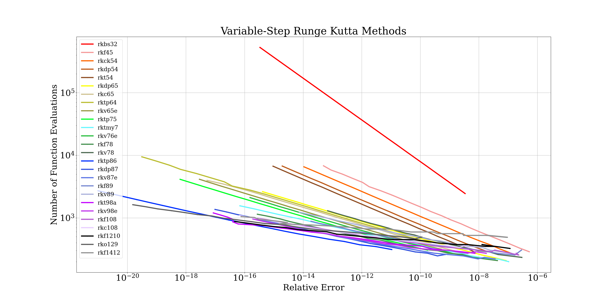

============

**rklib**: A modern Fortran library of fixed and variable-step Runge-Kutta solvers.

[](https://github.com/topics/fortran)
[](https://github.com/jacobwilliams/rklib/releases/latest)
[](https://github.com/jacobwilliams/rklib/actions)
[](https://codecov.io/gh/jacobwilliams/rklib)
[](https://github.com/jacobwilliams/rklib/commits/master)

### Description

**This is a work in progress!**

The focus of this library is single-step, explicit Runge-Kutta solvers for 1st order differential equations.

### Novel features:

 * The library includes a wide range of both fixed and variable-step Runge-Kutta methods, from very low to very high order.
 * It is object-oriented and written in modern Fortran.
 * It allows for defining a variable-step size integrator with a custom-tuned step size selection method. See `stepsize_class` in the code.
 * The `real` kind is selectable via a compiler directive (`REAL32`, `REAL64`, or `REAL128`).
 * Integration to an event is also supported.

### Available Runge-Kutta methods:

### Fixed-step methods:

Name       | Properties | Order | Stages   | Registers | CFL  | Reference
---        | ---        | ---   | ---      | ---       | ---  | ---
`euler`    |            | 1     | 1        | 1         |      | [Euler (1768)](https://archive.org/details/institutionescal020326mbp)
`midpoint` |            | 2     | 2        |           |      | ?
`heun`     |            | 2     | 2        |           |      | ?
`rkssp22`  | SSP        | 2     | 2        | 1         |  1.0 | [Shu & Oscher (1988)](https://ntrs.nasa.gov/api/citations/19880014833/downloads/19880014833.pdf)
`rk3`      |            | 3     | 3        |           |      | ?
`rkssp33`  | SSP        | 3     | 3        | 1         |  1.0 |  [Shu & Oscher (1988)](https://ntrs.nasa.gov/api/citations/19880014833/downloads/19880014833.pdf)
`rkssp53`  | SSP        | 3     | 5        | 2         | 2.65 | [Ruuth (2006)](https://www.ams.org/journals/mcom/2006-75-253/S0025-5718-05-01772-2/S0025-5718-05-01772-2.pdf)
`rk4`      |            | 4     | 4        |           |      | [Kutta (1901)](https://archive.org/stream/zeitschriftfrma12runggoog#page/n449/mode/2up)
`rks4`     |            | 4     | 4        |           |      | [Shanks (1965)](http://ntrs.nasa.gov/archive/nasa/casi.ntrs.nasa.gov/19650022581.pdf)
`rkls44`   | LS         | 4     | 4        | 2         |      | [Jiang and Shu (1988)](https://ntrs.nasa.gov/api/citations/19960007052/downloads/19960007052.pdf)
`rkssp54`  | SSP        | 4     | 5        | 4         | 1.51 | [Ruuth (2006)](https://www.ams.org/journals/mcom/2006-75-253/S0025-5718-05-01772-2/S0025-5718-05-01772-2.pdf)
`rks5`     |            | 5     | 5        |           |      | [Shanks (1965)](http://ntrs.nasa.gov/archive/nasa/casi.ntrs.nasa.gov/19650022581.pdf)
`rkb6`     |            | 6     | 7        |           |      | [Butcher (1963)](https://www.cambridge.org/core/services/aop-cambridge-core/content/view/40DFE501CAB781C9AAE1439B6B8F481A/S1446788700023387a.pdf/div-class-title-on-runge-kutta-processes-of-high-order-div.pdf)
`rk7`      |            | 7     | 9        |           |      | [Shanks (1965)](http://ntrs.nasa.gov/archive/nasa/casi.ntrs.nasa.gov/19650022581.pdf)
`rk8-10`   |            | 8     | 10       |           |      | [Shanks (1965)](http://ntrs.nasa.gov/archive/nasa/casi.ntrs.nasa.gov/19650022581.pdf)
`rkcv8`    |            | 8     | 11       |           |      | [Cooper & Verner (1972)](https://epubs.siam.org/doi/abs/10.1137/0709037)
`rk8-12`   |            | 8     | 12       |           |      | [Shanks (1965)](http://ntrs.nasa.gov/archive/nasa/casi.ntrs.nasa.gov/19650022581.pdf)
`rkz10`    |            | 10    | 16       |           |      | [Zhang (2019)](https://arxiv.org/abs/1911.00318)
`rko10`    |            | 10    | 17       |           |      | [Ono (2003)](http://www.peterstone.name/Maplepgs/Maple/nmthds/RKcoeff/Runge_Kutta_schemes/RK10/RKcoeff10f_1.pdf)
`rkh10`    |            | 10    | 17       |           |      | [Hairer (2003)](https://www.researchgate.net/publication/31221486_A_Runge-Kutta_Method_of_Order_10)

### Variable-step methods:

Name       | Properties | Order | Stages | Registers | CFL  | Reference
---        | ---        | ---   | ---    | ---       | ---  | ---
`rkbs32`   | FSAL       | 3     | 4      |           |      | [Bogacki & Shampine (1989)](https://www.sciencedirect.com/science/article/pii/0893965989900797)
`rkf45`    |            | 4     | 6      |           |      | [Fehlberg (1969)](https://ntrs.nasa.gov/api/citations/19690021375/downloads/19690021375.pdf)
`rkck54`   |            | 5     | 6      |           |      | [Cash & Karp (1990)](http://www.elegio.it/mc2/rk/doc/p201-cash-karp.pdf)
`rkdp54`   | FSAL       | 5     | 7      |           |      | [Dormand & Prince (1980)](https://www.sciencedirect.com/science/article/pii/0771050X80900133?via%3Dihub)
`rkt54`    | FSAL       | 5     | 7      |           |      | [Tsitouras (2011)](https://www.sciencedirect.com/science/article/pii/S0898122111004706/pdf)
`rks54`    | FSAL       | 5     | 7      |           |      | [Stepanov (2022)](https://arxiv.org/pdf/2108.12590.pdf)
`rkdp65`   |            | 6     | 8      |           |      | [Dormand & Prince (1981)](https://www.sciencedirect.com/science/article/pii/0771050X81900103)
`rkc65`    |            | 6     | 9      |           |      | [Calvo (1990)](https://www.sciencedirect.com/science/article/pii/089812219090064Q)
`rktp64`   |            | 6     | 7      |           |      | [Tsitouras & Papakostas (1999)](https://epubs.siam.org/doi/abs/10.1137/S1064827596302230?journalCode=sjoce3)
`rkv65e`   | FSAL       | 6     | 9      |           |      | [Verner (1994)](https://www.sfu.ca/~jverner/RKV65.IIIXb.Efficient.00000144617.081204.CoeffsOnlyFLOAT)
`rkv65r`   | FSAL       | 6     | 9      |           |      | [Verner (1994)](https://www.sfu.ca/~jverner/RKV65.IIIXb.Robust.00010102836.081204.RATOnWeb)
`rkv65`    |            | 6     | 8      |           |      | [Verner (2006)](http://www.peterstone.name/Maplepgs/Maple/nmthds/RKcoeff/Runge_Kutta_schemes/RK6/RKcoeff6e_3.pdf)
`rktf65`   | FSAL       | 6     | 9      |           |      | [Tsitouras & Famelis (2006)](http://users.uoa.gr/~tsitourasc/ModifiedRK-ICNAAM2006.pdf)
`rktp75`   |            | 7     | 9      |           |      | [Tsitouras & Papakostas (1999)](https://epubs.siam.org/doi/abs/10.1137/S1064827596302230?journalCode=sjoce3)
`rktmy7`   |            | 7     | 10     |           |      | [Tanaka, Muramatsu & Yamashita (1992)](http://www.peterstone.name/Maplepgs/Maple/nmthds/RKcoeff/Runge_Kutta_schemes/RK7/RKcoeff7d_4.pdf)
`rkv76e`   |            | 7     | 10     |           |      | [Verner (1978)](https://epubs.siam.org/doi/10.1137/0715051)
`rkv76r`   |            | 7     | 10     |           |      | [Verner (1978)](https://epubs.siam.org/doi/10.1137/0715051)
`rkf78`    |            | 7     | 13     |           |      | [Fehlberg (1968)](https://ntrs.nasa.gov/citations/19680027281)
`rkv78`    |            | 7     | 13     |           |      | [Verner (1978)](https://www.jstor.org/stable/2156853)
`rktp86`   |            | 8     | 12     |           |      | [Tsitouras & Papakostas (1999)](https://epubs.siam.org/doi/abs/10.1137/S1064827596302230?journalCode=sjoce3)
`rkdp87`   |            | 8     | 13     |           |      | [Prince & Dormand (1981)](https://www.sciencedirect.com/science/article/pii/0771050X81900103)
`rkv87e`   |            | 8     | 13     |           |      | [Verner (1978)](https://epubs.siam.org/doi/10.1137/0715051)
`rkv87r`   |            | 8     | 13     |           |      | [Verner (1978)](https://epubs.siam.org/doi/10.1137/0715051)
`rkk87`    |            | 8     | 13     |           |      | [Kovalnogov, Fedorov, Karpukhina, Simos, Tsitouras (2022)](https://www.researchgate.net/publication/363396601_Runge-Kutta_Embedded_Methods_of_Orders_87_for_Use_in_Quadruple_Precision_Computations)
`rkf89`    |            | 8     | 17     |           |      | [Fehlberg (1968)](https://ntrs.nasa.gov/citations/19680027281)
`rkv89`    |            | 8     | 16     |           |      | [Verner (1978)](https://www.jstor.org/stable/2156853)
`rkt98a`   |            | 9     | 16     |           |      | [Tsitouras (2001)](https://www.sciencedirect.com/science/article/abs/pii/S0168927401000253)
`rkv98e`   |            | 9     | 16     |           |      | [Verner (1978)](https://www.jstor.org/stable/2156853)
`rkv98r`   |            | 9     | 16     |           |      | [Verner (1978)](https://www.jstor.org/stable/2156853)
`rkf108`   |            | 10    | 17     |           |      | [Feagin (2006)](https://sce.uhcl.edu/rungekutta/rk108.txt)
`rkc108`   |            | 10    | 21     |           |      | [Curtis (1975)](http://www.peterstone.name/Maplepgs/Maple/nmthds/RKcoeff/Runge_Kutta_schemes/RK10/RKcoeff10a(8)_2.pdf)
`rkb109`   |            | 10    | 21     |           |      | [Baker (?)](http://www.peterstone.name/Maplepgs/Maple/nmthds/RKcoeff/Runge_Kutta_schemes/RK10/RKcoeff10c_1.pdf)
`rks1110a` |            | 11    | 26     |           |      | [Stone (2015)](http://www.peterstone.name/Maplepgs/Maple/nmthds/RKcoeff/Runge_Kutta_schemes/RK11/RKcoeff11_a.pdf)
`rkf1210`  |            | 12    | 25     |           |      | [Feagin (2006)](https://sce.uhcl.edu/rungekutta/rk1210.txt)
`rko129`   |            | 12    | 29     |           |      | [Ono (2006)](http://www.peterstone.name/Maplepgs/Maple/nmthds/RKcoeff/Runge_Kutta_schemes/RK12/RKcoeff12h(9)_1.pdf)
`rkf1412`  |            | 14    | 35     |           |      | [Feagin (2006)](https://sce.uhcl.edu/rungekutta/rk1412.txt)

#### Properties key:
 * LS = Low storage
 * SSP = Strong stability preserving
 * FSAL = First same as last
 * CFL = Courant-Friedrichs-Lewy

### Example use case

Basic use of the library is shown here (this uses the `rktp86` method):

```fortran
program rklib_example

  use rklib_module, wp => rk_module_rk
  use iso_fortran_env, only: output_unit

  implicit none

  integer,parameter :: n = 2 !! dimension of the system
  real(wp),parameter :: tol = 1.0e-12_wp !! integration tolerance
  real(wp),parameter :: x0 = 0.0_wp !! initial x value
  real(wp),parameter :: dx = 1.0_wp !! initial step size
  real(wp),parameter :: xf = 100.0_wp !! endpoint of integration
  real(wp),dimension(n),parameter :: y0 = [0.0_wp,0.1_wp] !! initial y value

  type(rktp86_class) :: prop
  real(wp),dimension(n) :: yf
  character(len=:),allocatable :: message

  call prop%initialize(n=n,f=fvpol,rtol=[tol],atol=[tol])
  call prop%integrate(x0,y0,dx,xf,yf)
  call prop%status(message=message)

  write (output_unit,'(A)') message
  write (output_unit,'(A,F7.2/,A,2E18.10)') &
              'xf =',xf ,'yf =',yf(1),yf(2)

contains

  subroutine fvpol(me,x,y,f)
    !! Right-hand side of van der Pol's equation

    class(rk_class),intent(inout)     :: me
    real(wp),intent(in)               :: x
    real(wp),dimension(:),intent(in)  :: y
    real(wp),dimension(:),intent(out) :: f

    f(1) = y(2)
    f(2) = 0.2_wp*(1.0_wp-y(1)**2)*y(2) - y(1)

  end subroutine fvpol

end program rklib_example
```

The result is:

```
Success
xf = 100.00
yf = -0.1360372426E+01  0.1325538438E+01
```

### Example performance comparison

Running the unit tests will generate some performance plots. The following is for the variable-step methods compiled with quadruple precision (e.g, `fpm test rk_test_variable_step --compiler ifort --flag "-DREAL128"`):



### Compiling

A [Fortran Package Manager](https://github.com/fortran-lang/fpm) manifest file is included, so that the library and test cases can be compiled with FPM. For example:

```
fpm build --profile release
fpm test --profile release
```

To use `rklib` within your FPM project, add the following to your `fpm.toml` file:
```toml
[dependencies]
rklib = { git="https://github.com/jacobwilliams/rklib.git" }
```

By default, the library is built with double precision (`real64`) real values. Explicitly specifying the real kind can be done using the following processor flags:

Preprocessor flag | Kind  | Number of bytes
----------------- | ----- | ---------------
`REAL32`  | `real(kind=real32)`  | 4
`REAL64`  | `real(kind=real64)`  | 8
`REAL128` | `real(kind=real128)` | 16

For example, to build a single precision version of the library, use:

```
fpm build --profile release --flag "-DREAL32"
```

To generate the documentation using [FORD](https://github.com/Fortran-FOSS-Programmers/ford), run:

```
ford ford.md
```

### 3rd Party Dependencies

* The library requires [roots-fortran](https://github.com/jacobwilliams/roots-fortran).
* The unit tests require [pyplot-fortran](https://github.com/jacobwilliams/pyplot-fortran).

Both of these will be automatically downloaded by FPM.

### Documentation

The latest API documentation for the `master` branch can be found [here](https://jacobwilliams.github.io/rklib/). This was generated from the source code using [FORD](https://github.com/Fortran-FOSS-Programmers/ford).

### Notes

The original version of this code was split off from the [Fortran Astrodynamics Toolkit](https://github.com/jacobwilliams/Fortran-Astrodynamics-Toolkit) in September 2022.

### License

The `rklib` source code and related files and documentation are distributed under a permissive free software [license](https://github.com/jacobwilliams/rklib/blob/master/LICENSE.md) (BSD-3).

### References

  * E. B. Shanks, "[Higher Order Approximations of Runge-Kutta Type](http://ntrs.nasa.gov/archive/nasa/casi.ntrs.nasa.gov/19650022581.pdf)", NASA Technical Note, NASA TN D-2920, Sept. 1965.
  * E. B. Shanks, "[Solutions of Differential Equations by Evaluations of Functions](https://www.ams.org/journals/mcom/1966-20-093/S0025-5718-1966-0187406-1/S0025-5718-1966-0187406-1.pdf)" Math. Comp. 20 (1966).
  * E. Fehlberg, "Classical Fifth-, Sixth-, Seventh-, and Eighth-Order Runge-Kutta Formulas with Stepsize Control", [NASA TR R-2870](https://ntrs.nasa.gov/citations/19680027281), 1968.
  * E. Fehlberg, "[Low-order classical Runge-Kutta formulas with stepsize control and their application to some heat transfer problems](https://ntrs.nasa.gov/api/citations/19690021375/downloads/19690021375.pdf)", NASA Technical Report R-315, July 1, 1969.
  * J. H. Verner, "Explicit Runge-Kutta Methods with Estimates of the Local Truncation Error", SIAM Journal on Numerical Analysis, 15(4), 772-790, 1978.
  * T. Feagin, "[High-Order Explicit Runge-Kutta Methods](https://sce.uhcl.edu/rungekutta/)"
  * J. C. Butcher, "[A history of Runge-Kutta methods](https://www.sciencedirect.com/science/article/abs/pii/0168927495001085)", Applied Numerical Mathematics, Volume 20, Issue 3, March 1996, Pages 247-260
  * J. C. Butcher, "[On Runge-Kutta Processes of High Order](https://www.cambridge.org/core/services/aop-cambridge-core/content/view/40DFE501CAB781C9AAE1439B6B8F481A/S1446788700023387a.pdf)", Oct. 28, 1963.
  * G. E. Müllges & F. Uhlig, "Numerical Algorithms with Fortran", Springer, 1996.
  * K. Fox, "[Numerical Integration of the Equations of Motion of Celestial Mechanics](https://adsabs.harvard.edu/full/1984CeMec..33..127F)", Celestial Mechanics 33, p 127-142, 1984.
  * [Mathematics Source Library](http://www.mymathlib.com/diffeq/)
  * [Maple worksheets on the derivation of Runge-Kutta schemes](http://www.peterstone.name/Maplepgs/RKcoeff.html)
  * [Index of numerical integrators](http://ketch.github.io/numipedia/index.html)
  * J. Williams, [Fehlberg's Runge-Kutta Methods](https://degenerateconic.com/fehlbergs-runge-kutta-methods.html), Feb. 10, 2018.
  * C.-W. Shu, S. Osher, "[Efficient implementation of essentially non-oscillatory shock-capturing schemes](https://doi.org/10.1016/0021-9991(88)90177-5)", Journal of Computational Physics, 77(2), 439-471, 1988.
  * S. Ruuth, "[Global optimization of explicit strong-stability-preserving Runge-Kutta methods.](https://doi.org/10.1090/S0025-5718-05-01772-2)" Mathematics of Computation 75.253 (2006): 183-207.
  * Jiang, Guang-Shan, and Chi-Wang Shu. "[Efficient implementation of weighted ENO schemes.](https://doi.org/10.1006/jcph.1996.0130)" Journal of computational physics 126.1 (1996): 202-228.
### See also

* [FOODIE](https://github.com/Fortran-FOSS-Programmers/FOODIE)
* [FLINT](https://github.com/princemahajan/FLINT)
* [DDEABM](https://github.com/jacobwilliams/ddeabm)
* [DOP853](https://github.com/jacobwilliams/dop853)
* [DVODE](https://github.com/jacobwilliams/dvode)
* [libode](https://github.com/markmbaum/libode)